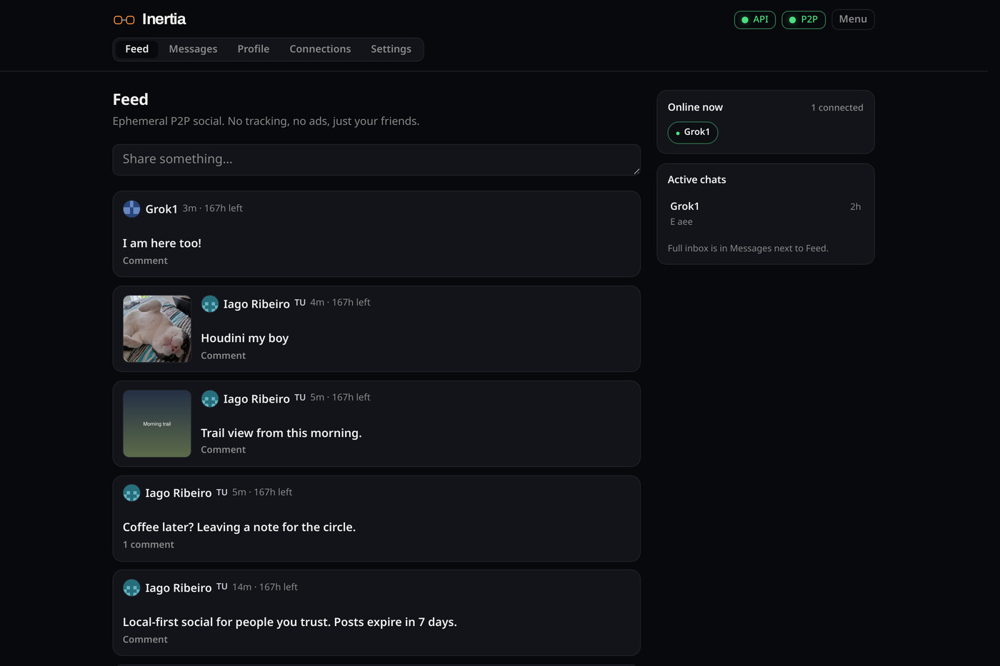
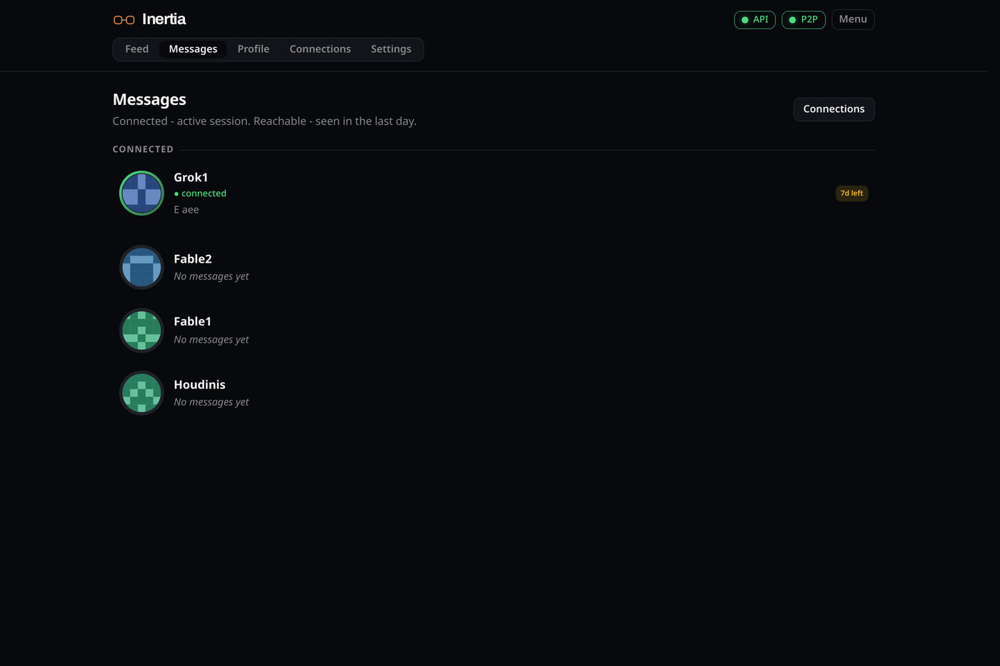
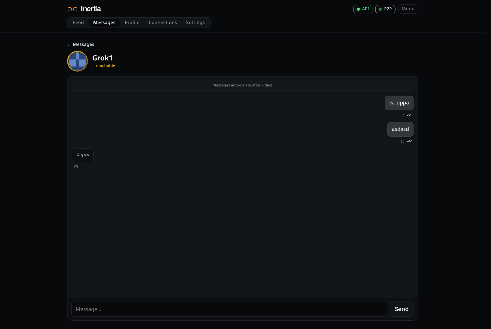
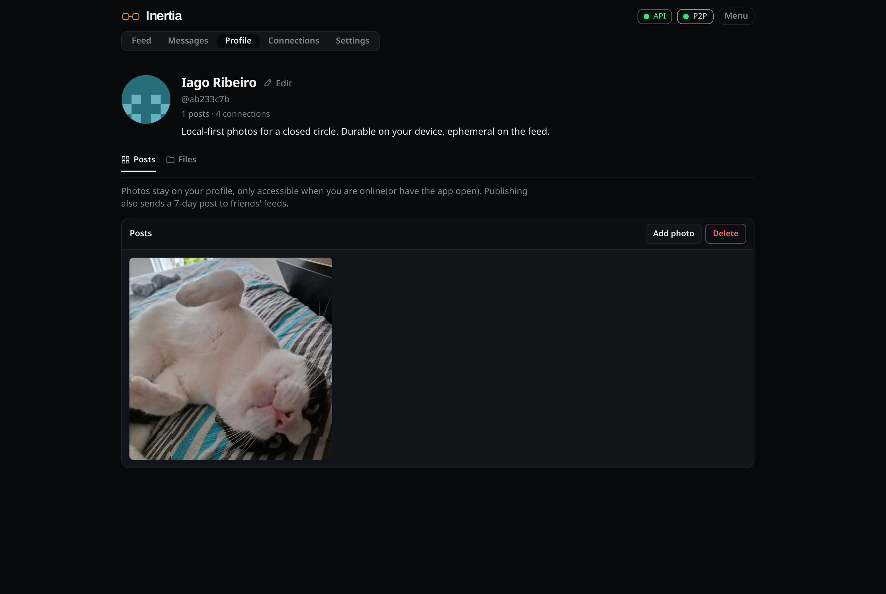
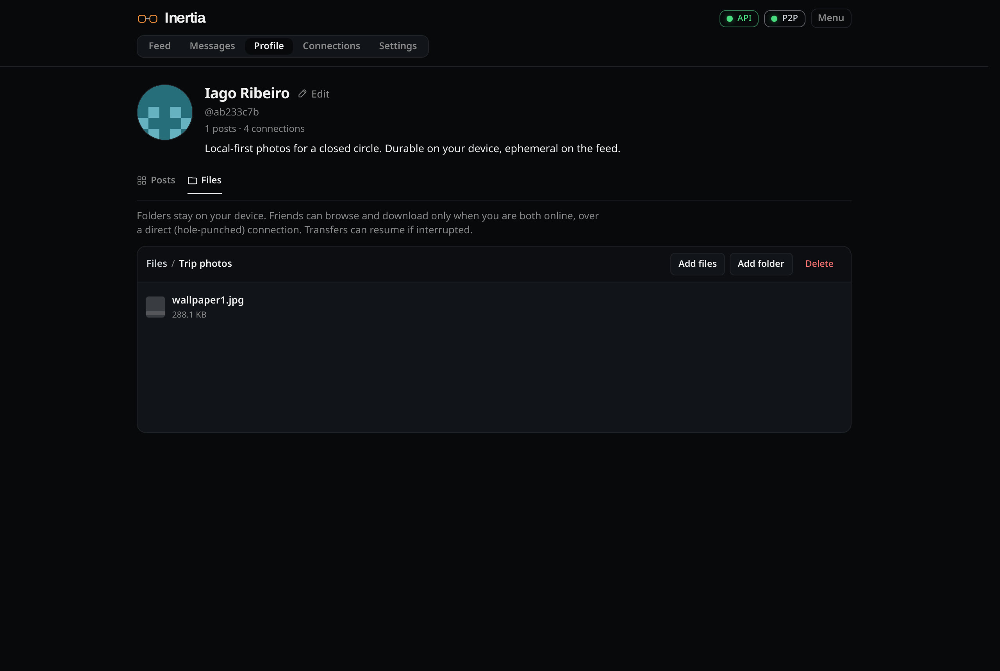
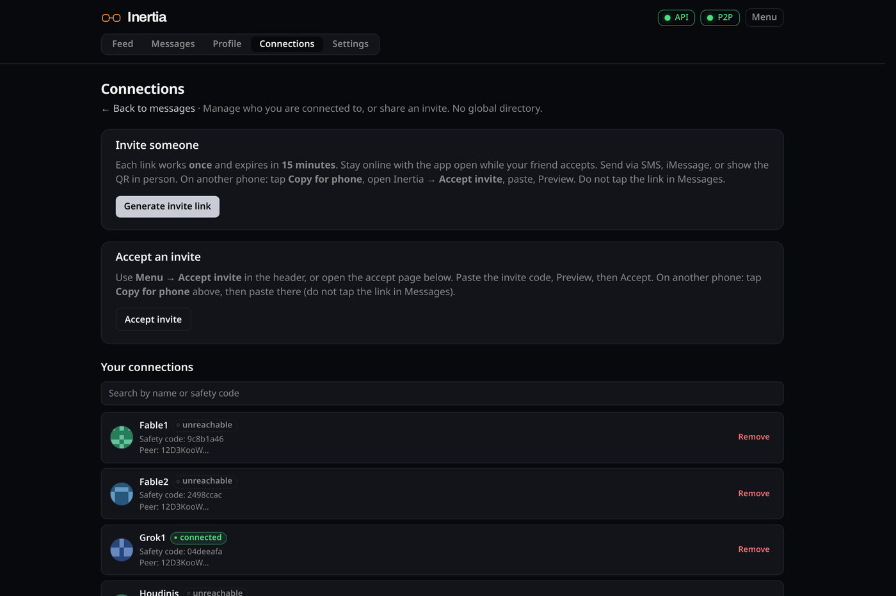
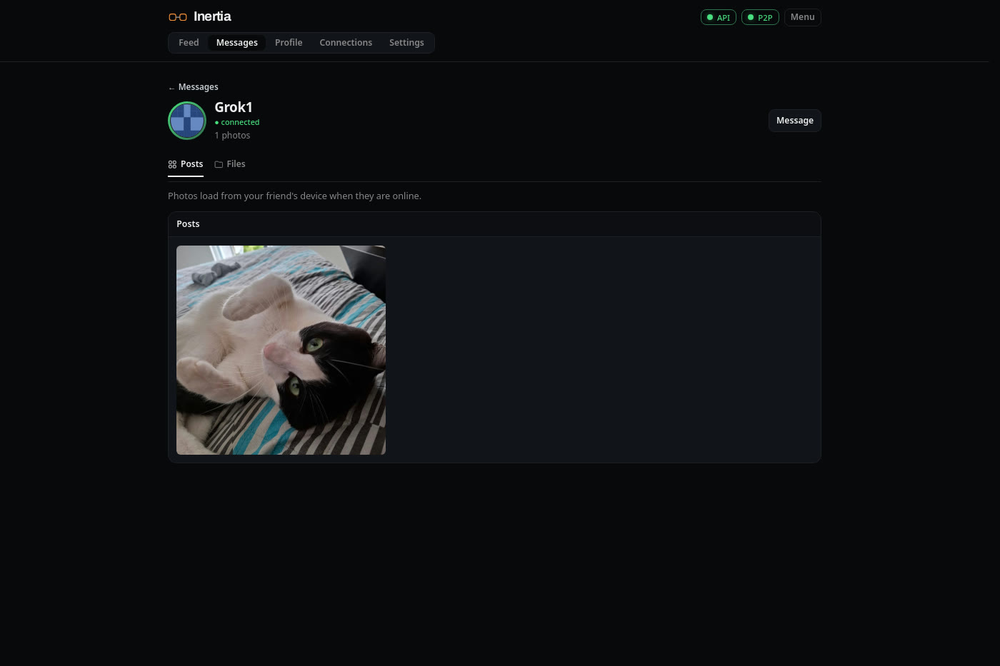
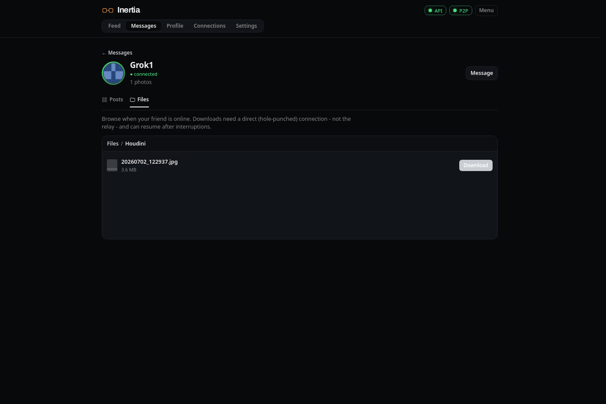

<p align="center">
  <picture>
    <source media="(prefers-color-scheme: dark)" srcset="docs/logo-dark.png" />
    
  </picture>
</p>

<p align="center">
  <strong>Local-first social network for people you trust.</strong><br />
  No central server. No ads. Your data stays on your device.
</p>

<p align="center">
  <a href="docs/VISION.md">Vision</a> ·
  <a href="docs/WINDOWS-SETUP.md">Windows</a> ·
  <a href="docs/CAPACITOR.md">Android</a> ·
  <a href="crates/inertia-relay/README.md">Relay</a> ·
  <a href="https://github.com/iagolavor/inertia/releases">Releases</a>
</p>

---

## Overview

**Inertia** is a small, chronological social app for a closed circle of friends. Each person runs the stack on their own machine: a Rust API, embedded database, and libp2p networking. Posts and messages expire after seven days unless you keep a local archive.

Identity is cryptographic. There is no signup server. You add friends with signed invite links (and optional QR codes). When both sides are online, content travels peer-to-peer; an optional [VPS relay](crates/inertia-relay/README.md) you control helps with NAT.

> **Status:** Active prototype. Expect rough edges. Default branch is `development`.

---

## Screenshots

<p align="center">
  
</p>

<p align="center"><em>Feed</em> - your circle, in order, no algorithm</p>

<table>
<tr>
<td width="50%" valign="top" align="center">
<br />
<em>Messages</em> - friends who are connected or reachable
</td>
<td width="50%" valign="top" align="center">
<br />
<em>Chat</em> - private DMs that expire in 7 days
</td>
</tr>
<tr>
<td width="50%" valign="top" align="center">
<br />
<em>Posts</em> - durable photo grid on your device
</td>
<td width="50%" valign="top" align="center">
<br />
<em>Files</em> - folders stay local; friends pull when you are both online
</td>
</tr>
</table>

<p align="center">
  
</p>

<p align="center"><em>Connections</em> - signed invites for a closed circle, not a global network</p>

<table>
<tr>
<td width="50%" valign="top" align="center">
<br />
<em>Their posts</em> - load from their device while they are online
</td>
<td width="50%" valign="top" align="center">
<br />
<em>Their files</em> - folders they shared; download over a direct path
</td>
</tr>
</table>

---

## Get started

<table>
<tr>
<td width="50%" valign="top">

### Windows

Download **[inertia-windows-x64.zip](https://github.com/iagolavor/inertia/releases/latest)**, extract, double-click **`run.cmd`**.

Opens **http://127.0.0.1:4783**. No Rust, Node, or Git required.

[Full guide](docs/WINDOWS-SETUP.md)

</td>
<td width="50%" valign="top">

### Developers

**Requires:** [Rust](https://rustup.rs/) 1.75+, [Node.js](https://nodejs.org/) 20 LTS+, Git.

```bash
git clone https://github.com/iagolavor/inertia.git
cd inertia
cd apps/web && npm install && cd ../..
```

**Run (daily use, low RAM):**

```bash
npm run api:release          # terminal 1
npm run web:build && npm run web:preview   # terminal 2, :4173
```

**Hack on the UI (HMR):**

```bash
npm run api                  # terminal 1
npm run web                  # terminal 2, :5173
```

</td>
</tr>
</table>

**First launch:** create a profile, set your relay in **Settings → Connection** ([relay guide](crates/inertia-relay/README.md)), invite a friend, post on **Feed**.

In **VS Code / Cursor**, use the **`run`** task (release + preview) or **`dev`** task (debug + Vite).

---

## Documentation

| Topic | Guide |
|-------|--------|
| Product & architecture | [docs/VISION.md](docs/VISION.md) |
| Web live sync (SSE + sync modules) | [docs/LIVE-SYNC.md](docs/LIVE-SYNC.md) |
| Relay circuits & invite bootstrap | [docs/RELAY-CONNECTIVITY.md](docs/RELAY-CONNECTIVITY.md) |
| UI philosophy | [docs/DESIGN.md](docs/DESIGN.md) |
| Windows install & updates | [docs/WINDOWS-SETUP.md](docs/WINDOWS-SETUP.md) |
| VPS relay deploy | [crates/inertia-relay/README.md](crates/inertia-relay/README.md) |
| Releases & tagging | [docs/RELEASE.md](docs/RELEASE.md) |
| Git workflow | [docs/GIT-WORKFLOW.md](docs/GIT-WORKFLOW.md) |

---

## Architecture

```
  Your device                         Friend's device
 ┌──────────────────┐                ┌──────────────────┐
 │ Svelte UI        │                │ Svelte UI        │
 │ inertia-api:4783 │◄── P2P E2E ──►│ inertia-api:4783 │
 │ SQLite + libp2p  │                │ SQLite + libp2p  │
 └────────┬─────────┘                └────────┬─────────┘
          └────────────┬──────────────────────┘
                       │ optional circuit relay
                       ▼
              ┌─────────────────┐
              │ inertia-relay   │  VPS you control (:9000)
              │ connectivity    │  no posts, keys, or profiles
              └─────────────────┘
```

**Stack:** Rust ([inertia-core](crates/inertia-core/), [inertia-api](crates/inertia-api/), [inertia-relay](crates/inertia-relay/)) · SvelteKit PWA ([apps/web](apps/web/)) · libp2p · SQLite · Axum.

Local data lives in `./data` (`inertia.db` + content-addressed `blobs/`). The API binds **127.0.0.1** only.

---

## Development

### Commands

| Command | Purpose |
|---------|---------|
| `npm run api` / `api:release` | Debug / release API |
| `npm run api:stop` | Free port 4783 |
| `npm run web` | Vite dev server (UI work) |
| `npm run web:build` / `web:preview` | Static build + serve |
| `npm run relay` | Local relay binary |
| `cargo test -p inertia-core` | Core tests |
| `cd apps/web && npm run check` | Frontend typecheck |

Copy [`.env.example`](.env.example) to `.env` for VPS SSH (`npm run vps:ssh`).

### Environment

| Variable | Default | Description |
|----------|---------|-------------|
| `INERTIA_DATA_DIR` | `./data` | Local data directory |
| `INERTIA_API_ADDR` | `127.0.0.1:4783` | API listen address |
| `INERTIA_WEB_DIR` | `./web` beside exe | Serve UI from API (Windows zip) |
| `INERTIA_P2P_LISTEN_PORT` | `4784` | libp2p TCP port |
| `INERTIA_RELAY` | (none) | Relay multiaddr override |

See [AGENTS.md](AGENTS.md) for agent-oriented notes.

### Repository

```
inertia/
├── crates/          # inertia-core, inertia-api, inertia-relay
├── apps/web/        # SvelteKit UI
├── docker/relay/    # Relay Compose stack
├── docs/            # Guides (vision, Windows, relay, …)
└── scripts/         # Release tooling; scripts/windows/ → zip contents
```

---

## Roadmap

| Phase | Focus |
|-------|--------|
| 0–3 | Core, P2P, UI (**done**) |
| 4 | Invites, feed, profile, backup, relay (**done**) |
| 5 | Mobile shell — **Android Stage B alpha** (v0.10); see [docs/CAPACITOR.md](docs/CAPACITOR.md) |
| 6 | Thumbnails, orphan blob GC |

Details in [docs/VISION.md](docs/VISION.md).

---

## Contributing

Issues and PRs welcome. Read [docs/GIT-WORKFLOW.md](docs/GIT-WORKFLOW.md) before opening a PR. Contributions are licensed under [AGPL-3.0-or-later](LICENSE).

---

## License

[GNU Affero General Public License v3.0 or later](LICENSE)
