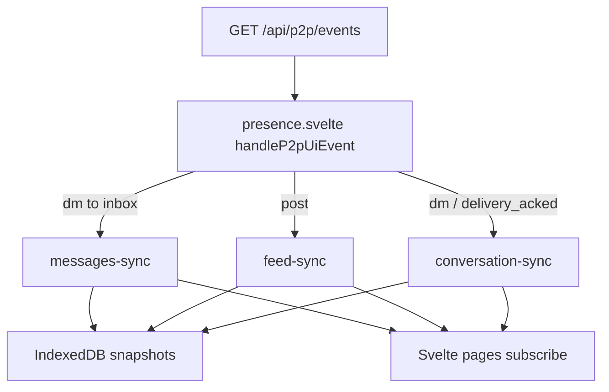
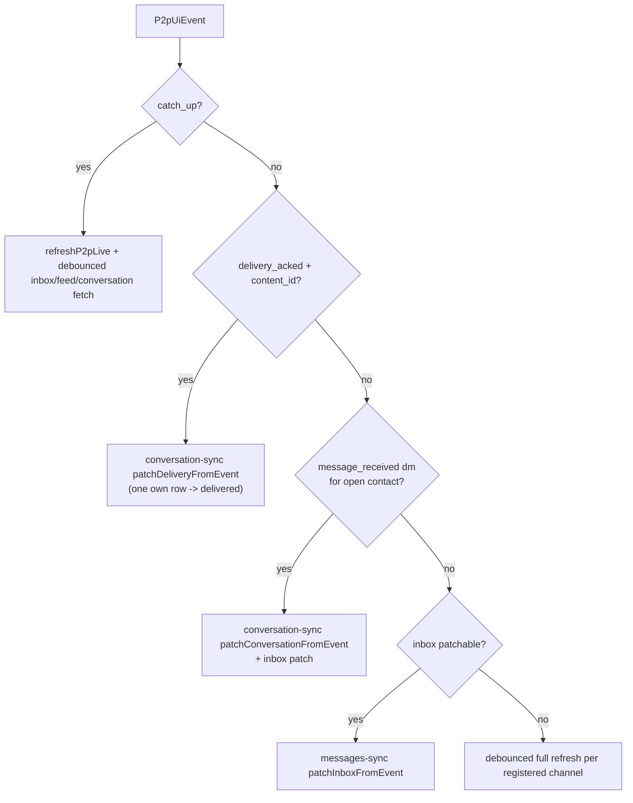
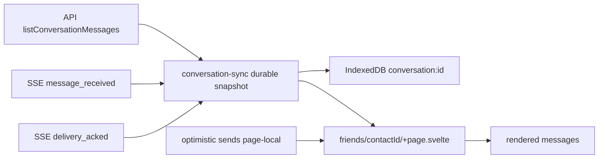
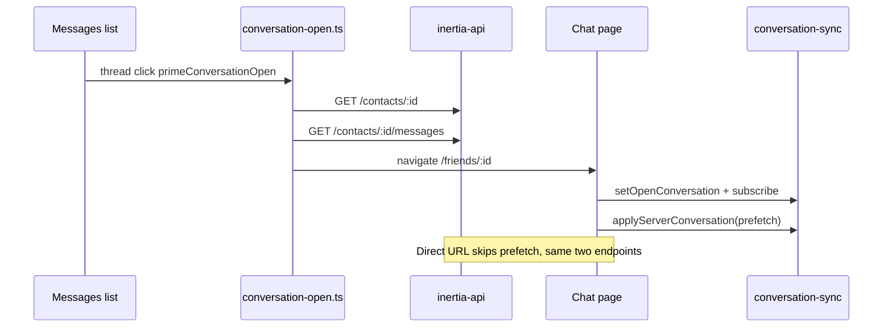
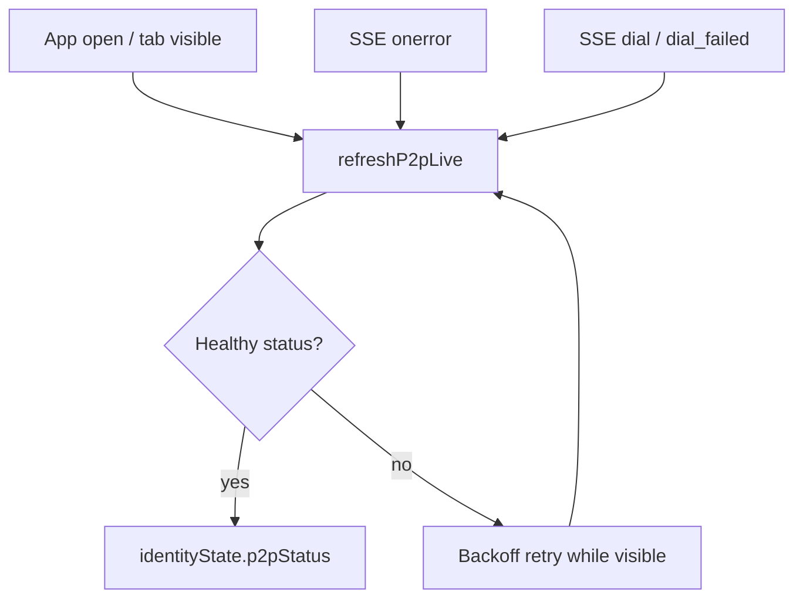

# Live sync: SSE and sync modules

The Svelte UI stays up to date with local P2P activity through **Server-Sent Events (SSE)** and three **sync modules** that own durable snapshots and IndexedDB cache writes.

This doc describes the current web architecture: SSE (`GET /api/p2p/events`) plus sync modules for durable UI state. Interval polling has been removed; reconciliation runs on SSE events, tab visibility, and targeted fallbacks.

---

## End-to-end flow

```plaintext
libp2p loop (inertia-core)
  -> P2pEvent (message, ack, peer, outbox, …)
  -> ActivityLog + P2pUiEvent broadcast bus
  -> GET /api/p2p/events (SSE)
  -> p2p-events.svelte.ts (EventSource)
  -> presence.svelte.ts handleP2pUiEvent
  -> messages-sync | feed-sync | conversation-sync
  -> IndexedDB snapshot + page subscribers
```

**Local-first rule:** the API and SQLite on `127.0.0.1:4783` are the source of truth. SSE pushes deltas; full fetches reconcile when events are missed.

---

## Sync modules

Three modules follow the same contract: **mutate durable state, persist cache inside `emit()`, notify subscribers.**

| Module | Scope | IndexedDB key | SSE inline patches |
|--------|-------|---------------|-------------------|
| `messages-sync` | Thread list (contacts + inbox) | `messages` | `message_received` (dm) |
| `feed-sync` | Home feed | `feed` | `message_received` (post) |
| `conversation-sync` | Open chat (per `contactId`) | `conversation:{id}` | `message_received` (dm), `delivery_acked` |

**Pages subscribe and render.** Optimistic sends (`pending-*` message IDs) stay page-local in the chat composer and are never written to cache.

### Source files

| Area | Path |
|------|------|
| SSE stream (frontend) | `apps/web/src/lib/p2p-events.svelte.ts` |
| Event routing | `apps/web/src/lib/presence.svelte.ts` |
| Event predicates | `apps/web/src/lib/p2p-event-handlers.ts` |
| Inbox / thread list | `apps/web/src/lib/messages-sync.ts` |
| Feed | `apps/web/src/lib/feed-sync.ts` |
| Open conversation | `apps/web/src/lib/conversation-sync.ts` |
| IndexedDB cache | `apps/web/src/lib/local-cache.ts` |
| SSE handler (API) | `crates/inertia-api/src/routes/p2p.rs` |
| UI event emission | `crates/inertia-core/src/engine/activity.rs` |

---

## Architecture diagram



---

## SSE event routing (messages)

`handleP2pUiEvent` tries **inline patches first**, then **debounced full refresh** on registered channels (inbox, feed, open conversation).



### Event kinds (message-related)

| `kind` | Typical use | Inline patch |
|--------|-------------|--------------|
| `message_received` | New dm or post | inbox, feed, or conversation (by `content_type`) |
| `delivery_acked` | Recipient acked your sent message | conversation (`content_id` required) |
| `outbox_flush` | Batch send completed | fallback refresh (no per-message payload today) |
| `catch_up` | SSE reconnect | full reconcile on all message channels |
| `peer_connected` / `peer_disconnected` | Presence | inbox + conversation refresh; live P2P status |

---

## Open chat state layers



- **Durable rows** live in `conversation-sync` and IndexedDB (no `pending-*` IDs).
- **Optimistic sends** are merged at render time via `mergeConversationMessages` in `dmThreads.ts`.
- Each `delivery_acked` event updates **one** row by `content_id`. Multiple acks on different sent messages produce multiple events.

---

## Opening a conversation (fetch contract)

Thread list click prefetches before navigation so the header and messages can paint quickly.



| Endpoint | Purpose |
|----------|---------|
| `GET /contacts/:contact_id` | One contact with live P2P presence |
| `GET /contacts/:contact_id/messages` | Full conversation for that friend |

Opening a DM does **not** refetch `/identity` or the full `/contacts` roster on every navigation.

---

## Backend: `P2pUiEvent` payloads

Defined in `crates/inertia-core/src/engine/activity.rs` and streamed as JSON over SSE.

**`message_received`** includes: `sender_id`, `contact_id`, `content_id`, `body`, `content_type`, `expires_at`.

**`delivery_acked`** includes: `content_id`, `contact_id` (from outbox `recipient_id` or contact matched by `peer_id`), `content_type: "message"`.

Events without structured fields only update the activity log string; the UI falls back to debounced HTTP refresh.

---

## Cache and offline read

`local-cache.ts` stores fingerprinted snapshots in IndexedDB (`inertia-cache` / `snapshots`). Sync modules call `writeCached*` inside `emit()` only, so pages never duplicate cache writes after mutations.

When the API is offline, pages hydrate from cache (`readCachedMessages`, `readCachedConversation`, etc.) and show a "saved · …" badge until live data returns.

---

## Reconciliation (no interval polling)

List and feed data update through **SSE inline patches** first. A **debounced HTTP refresh** runs only when a patch cannot apply (for example `outbox_flush` without per-message ids) or when the SSE stream reconnects (`catch_up`).

| Trigger | What refreshes |
|---------|----------------|
| SSE `message_received` / `delivery_acked` | Inline patch via sync module `emit()` |
| SSE `catch_up` (stream reconnect) | `refreshP2pLive` + debounced inbox/feed/conversation fetch |
| Tab visible | `refreshIdentity`, `refreshP2pOnAppOpen`, `refreshMessagesOnVisible`, page `load*` |
| Page mount | Initial `loadFeed` / `refreshInboxSilently` / `load` conversation |
| SSE `peer_*` / `dial` / `dial_failed` | `refreshP2pLive` |

### P2P status refresh

The header P2P pill no longer polls on a fixed interval. Status loads on **app open** and **tab visible** (`refreshP2pOnAppOpen`). If `/p2p/status` fails with a transport **offline** error, the UI marks the API offline, stops SSE, and stops retries until `refreshIdentity` succeeds again. Timeouts only schedule a coalesced retry and do not flip `apiOnline`. While the API is up but P2P looks unhealthy (relay unreachable, `tone` error/off), a **backoff retry** (15s to 60s) runs while the tab is visible.

When the SSE stream errors, the client **closes EventSource** (no browser auto-reconnect loop) and runs a single silent `refreshIdentity` health probe. If the API is down, `apiOnline` flips off and the stream stays closed until the API returns.



Registered routes still expose refresh callbacks (`registerInboxRefresh`, etc.) so SSE fallbacks can debounce a full fetch for the active view only.

---

## Tests

| Suite | What it covers |
|-------|----------------|
| `apps/web/src/lib/live-sync.test.ts` | inbox, feed, conversation inline patches |
| `apps/web/src/lib/p2p-event-handlers.test.ts` | event kind predicates |
| `crates/inertia-core/src/engine/activity.rs` (unit) | `P2pUiEvent` payload for message and delivery ack |
| `crates/inertia-api/tests/p2p_events_sse.rs` | SSE stream wiring |

```bash
cargo test -p inertia-core -p inertia-api
cd apps/web && npm run test
```

---

## Related docs

- [VISION.md](./VISION.md) - product and stack overview
- [DESIGN.md](./DESIGN.md) - UI philosophy
- [CAPACITOR.md](./CAPACITOR.md) - mobile shell (same sync modules in the WebView)
