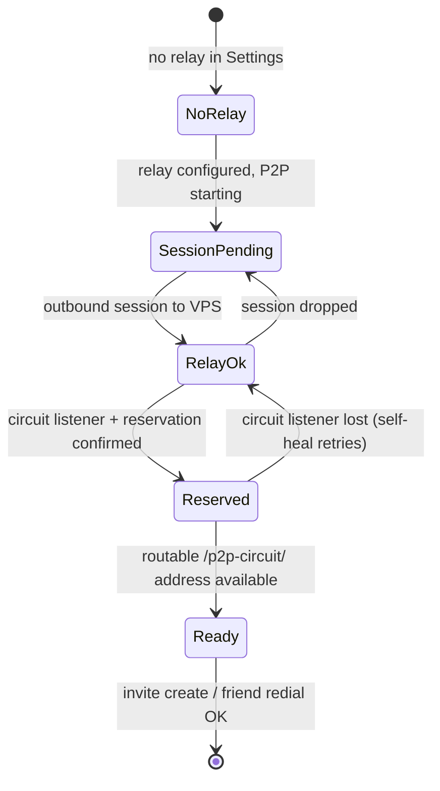
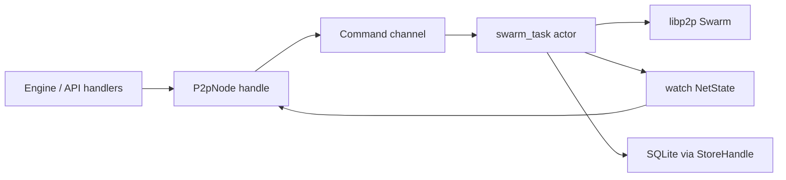
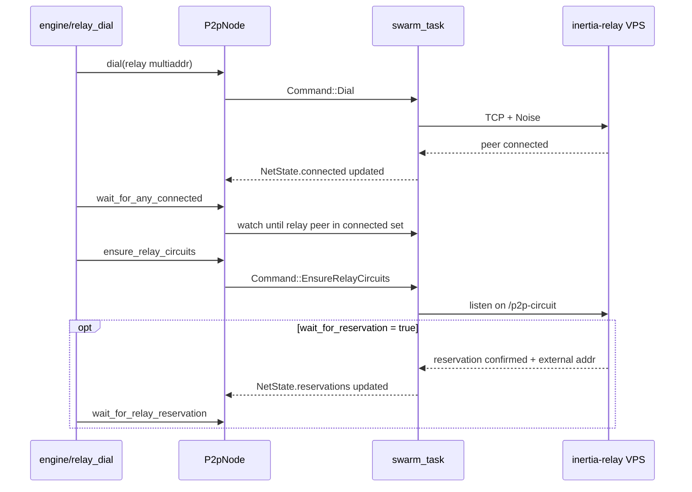
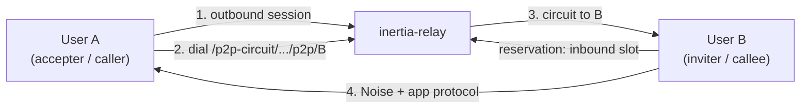
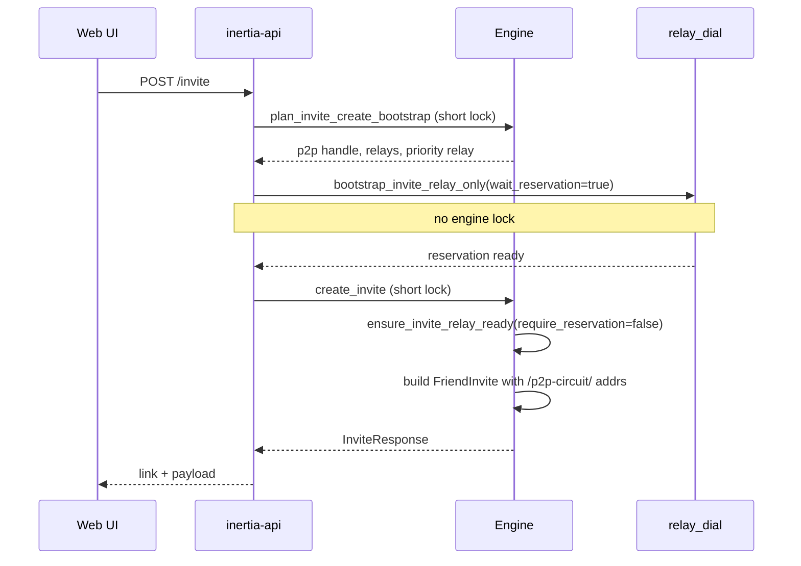
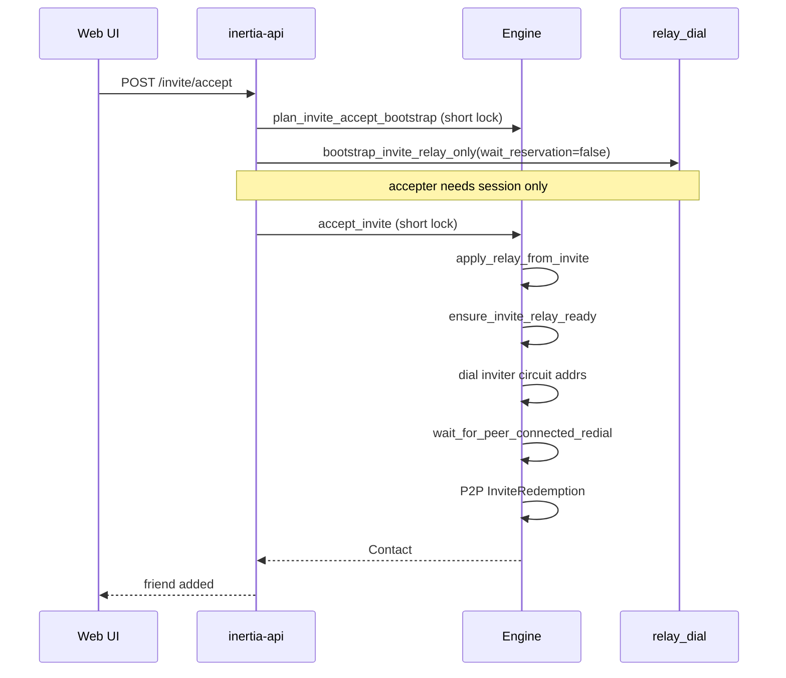
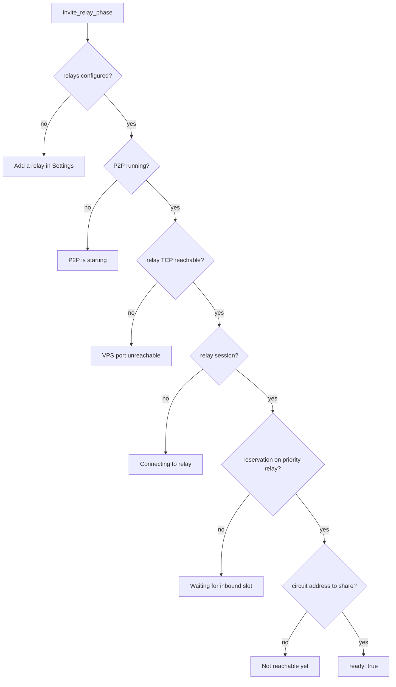

# Relay connectivity: P2P circuits and invite bootstrap

Inertia routes friend traffic over **libp2p relay circuits** through `inertia-relay` on a VPS (or a local relay in dev). A configured relay is **required** for invites and friend reachability; LAN and direct TCP are not used for friends. Each device still runs `inertia-api` + `inertia-core` locally; the relay is connectivity only (no SQLite, no decrypted payloads).

This doc describes the current **inertia-core** connection design: swarm actor, relay bootstrap, invite gates, and friend redials. For deployment, see [inertia-relay README](../crates/inertia-relay/README.md).

---

## End-to-end topology

```plaintext
User A device                         User B device
┌─────────────────────┐               ┌─────────────────────┐
│ SvelteKit  →  /api  │               │ SvelteKit  →  /api  │
│ inertia-core + P2P  │               │ inertia-core + P2P  │
│ SQLite + blobs      │               │ SQLite + blobs      │
└──────────┬──────────┘               └──────────┬──────────┘
           │  E2E encrypted envelopes            │
           │  (Noise + ChaCha20)                 │
           └────────────┬────────────────────────┘
                        │  /p2p-circuit/  (TCP via VPS)
                        ▼
              ┌─────────────────────┐
              │  inertia-relay      │
              │  circuit relay v2   │
              │  no user data       │
              └─────────────────────┘
```

**Local-first rule:** friend multiaddrs stored in SQLite and used for redial are **relay-circuit paths only**. LAN and direct TCP are filtered out (`p2p/multiaddr.rs` → `filter_friend_multiaddrs`). Local TCP listen on the device is still used as libp2p transport to reach the VPS.

---

## Two relay layers

Do not conflate outbound session health with inbound reachability.

| Layer | Meaning | Typical latency | UI |
|-------|---------|-----------------|-----|
| **Relay session** | Outbound libp2p TCP + Noise session to the VPS relay peer | ~10 ms | Header **Relay OK** |
| **Relay reservation** | Inbound circuit slot on the VPS so others can dial `/p2p-circuit/p2p/<you>` | ~150 ms after session (event-driven) | `GET /invite/readiness`; Friends **Generate** enabled |



`invite_readiness` in `engine/invite.rs` walks these phases for the UI. Invite **create** needs **Reserved** (API bootstrap waits for reservation). Invite **accept** needs **Relay OK** on the accepter, then dials the inviter's circuit addresses.

---

## Swarm actor (inertia-core)

The libp2p `Swarm` is owned by a single async task. `P2pNode` is a thin, clone-able handle: command channel in, `watch::Receiver<NetState>` out.



**Commands:** `Dial`, `EnsureRelayCircuits`, `SendRequest`, `SendResponse`, …

**NetState:** connected peer ids, relay reservations, direct peers, listen/external addresses.

**Self-heal:** dead circuit listeners trigger re-listen + re-reserve after 3s backoff inside the actor (no engine involvement).

### Source files

| Area | Path |
|------|------|
| Swarm actor | `crates/inertia-core/src/p2p/swarm_task.rs` |
| Thin node handle | `crates/inertia-core/src/p2p/node.rs` |
| Behaviour (relay + DCUtR) | `crates/inertia-core/src/p2p/behaviour.rs` |
| Friend multiaddr filter | `crates/inertia-core/src/p2p/multiaddr.rs` |
| Relay bootstrap waits | `crates/inertia-core/src/engine/relay_dial.rs` |
| Invite readiness / gates | `crates/inertia-core/src/engine/invite.rs` |
| Friend redial | `crates/inertia-core/src/engine/p2p.rs` |
| Invite API (short lock) | `crates/inertia-api/src/routes/invite.rs` |
| Relay binary | `crates/inertia-relay/src/main.rs` |

---

## Relay bootstrap sequence

`relay_dial::connect_and_reserve` (used by friend redial and invite bootstrap):

```plaintext
1. Dial each configured relay multiaddr
2. wait_for_any_connected (event-driven, up to RELAY_*_SESSION_WAIT)
3. ensure_relay_circuits (open inbound /p2p-circuit listeners on connected relays)
4. [optional] wait_for_relay_reservation (event-driven, up to RELAY_*_RESERVATION_WAIT)
```



Waits use `watch::Receiver::wait_for` + timeout, not sleep polling.

---

## Dialing a friend via the relay

Stored and computed dial targets look like:

```plaintext
/ip4/<VPS>/tcp/9000/p2p/<RELAY_PEER>/p2p-circuit/p2p/<FRIEND_PEER>
```



`contact_dial_addrs` builds circuits from configured relays + filtered stored multiaddrs. `redial_known_peers` runs only after `bootstrap_relays_for_friend_dial` confirms a local reservation.

---

## Invite create (two-phase API lock)

The engine mutex is **not** held during dial + wait (up to ~20s). See comment in `routes/invite.rs`.



Phase 1 does the heavy reservation wait. Phase 2 reconciles relay state and mints the signed invite.

---

## Invite accept



The inviter must stay online with an active reservation while the accepter dials.

---

## Invite readiness (UI gate)

`GET /invite/readiness` before **Generate**:



---

## VPS relay requirement

`inertia-relay` must advertise a **routable external address** in reservation responses. Without it, clients reject reservations and circuit listeners flap.

- Auto: identify candidates on the VPS
- Manual: `INERTIA_RELAY_PUBLIC_ADDR=/ip4/<VPS_IP>/tcp/9000`

Redeploy the relay after upgrading `inertia-relay`. See troubleshooting in [inertia-relay README](../crates/inertia-relay/README.md).

---

## Relay sizing (defaults and fan-out)

`inertia-relay` defaults (overridable via env):

| Cap | Default | Meaning |
|-----|---------|---------|
| `max_reservations` | **128** | Peers that can be **inbound-dialable** on this relay at once (~online reachable users) |
| `max_circuits` | **64** | **Concurrent relayed paths** (A via relay to B), not user count |
| `max_*_per_peer` | **4** | One client cannot hoard more than 4 slots (abuse guard) |

**Per-source-peer circuit cap** counts circuits **originated by one peer**. When Alice posts to 20 friends, each delivery is Alice → friend over the relay (one circuit per active friend path). Inertia fans out **sequentially** in `feed.rs` and retries via outbox when a friend connects, so all 20 rarely open circuits in the same instant. If many friends are connected via relay and Alice delivers to more than **4 at once**, the relay may deny extra circuits until some close.

Raising `INERTIA_RELAY_MAX_CIRCUITS_PER_PEER` from 4 to 8 allows heavier poster fan-out via relay without changing global caps. Reservations are held **while the app is online**, not per message.

---

## DCUtR (optional upgrade)

DCUtR hole punching remains in the behaviour stack. Friend **discovery and redial** stay on relay circuits; a live session may later upgrade to direct transport. Bulk transfer logic (e.g. video chunks) may prefer direct when available - see [VIDEO-P2P-PLAN.md](./VIDEO-P2P-PLAN.md).

---

## Related docs

| Doc | Focus |
|-----|--------|
| [LIVE-SYNC.md](./LIVE-SYNC.md) | SSE + sync modules after P2P delivers content |
| [VISION.md](./VISION.md) | Product principles and invite trust model |
| [CAPACITOR.md](./CAPACITOR.md) | Android on-device install; invite accept over relay |
